# QTsys

QTsys 是一个面向量化研究、策略生成、真实数据回测、因子评估与组合分析的一体化本地系统。系统围绕“设置数据源 → 编写/生成策略 → 回测验证 → 因子研究 → 组合决策”这一完整研究链路设计，适合个人研究者和策略开发者持续迭代使用。

## 系统亮点

- 策略工作台：支持手工编写、内置模板、AI 生成和策略库管理
- 策略 × 因子联动：策略代码和 AI 均可直接调用系统因子库
- 真实数据回测：接入 Tushare，支持系统股票池、自定义股票池和代码列表
- 因子看板：批量评估 Alpha191 因子表现，查看超额、IC、覆盖率、分位曲线和因子详情
- 组合分析：对多个回测结果做横向比较、相关性分析和组合优化
- 新闻与看盘：结合市场快照、新闻流和情绪信息辅助策略判断

## 系统架构

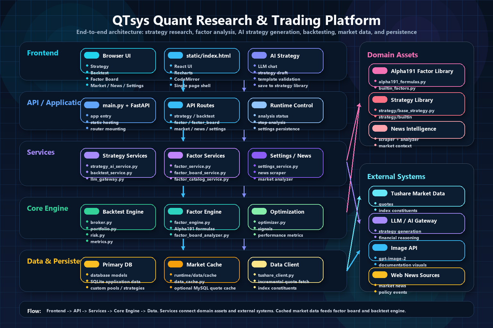

### 架构说明

- 前端层：`static/index.html` 承载单页应用，覆盖回测、策略、因子、因子看板、新闻、设置等主要页面
- 接口层：`main.py` 通过 FastAPI 暴露业务接口，负责路由挂载、静态资源提供和应用入口
- 服务层：`services/` 负责策略生成、回测编排、因子分析、因子看板、设置管理和 AI 网关封装
- 核心引擎层：`engine/` 与 `factor/` 负责回测执行、风险指标、组合分析、因子计算与 Alpha191 分析
- 数据层：SQLite 保存业务元数据，`runtime/data/cache` 与可选 MySQL 用于行情缓存和因子看板结果存储
- 外部依赖：系统可接入 Tushare、LLM 接口、图像接口和新闻源，形成研究闭环

系统主链路为：

`前端页面 -> API 路由 -> 服务编排 -> 回测/因子引擎 -> 数据缓存与数据库`

## 功能界面预览

### 1. 系统设置

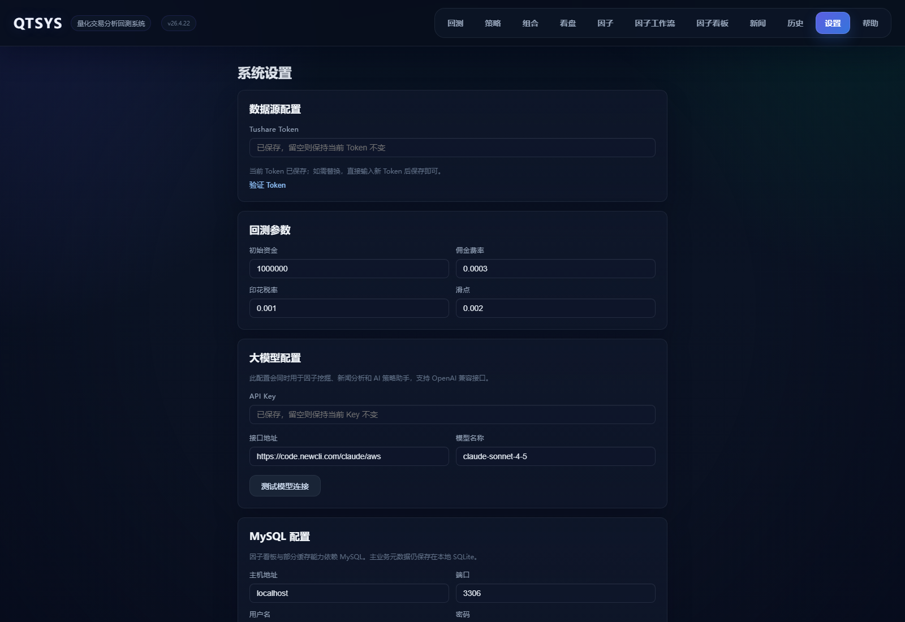

- 配置 Tushare Token、回测参数、AI 模型和 MySQL 连接
- 因子看板、AI 策略助手和新闻分析均依赖该页面中的配置

### 2. 策略工作台与 AI 策略助手

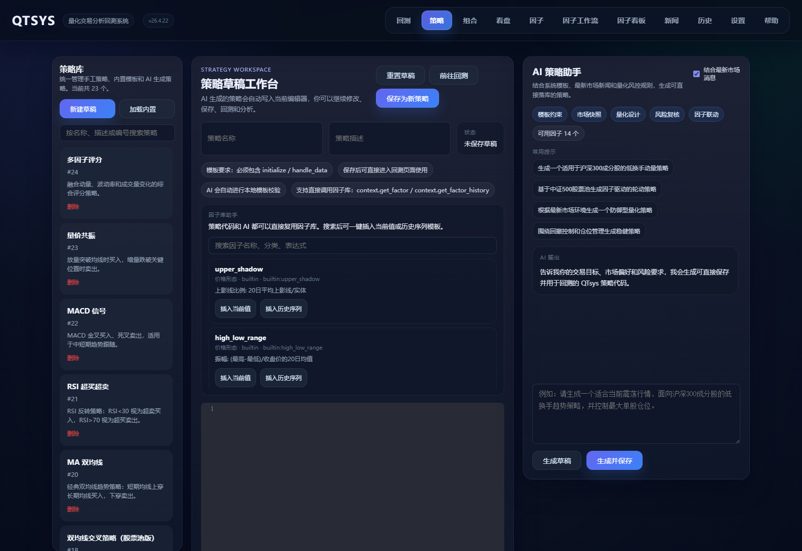

- 左侧统一管理手工策略、内置模板和 AI 生成策略
- 中央为策略草稿工作台，可继续编辑、保存并送入回测
- 右侧 AI 助手支持基于模板、新闻和因子上下文生成可执行策略代码

### 3. 回测配置

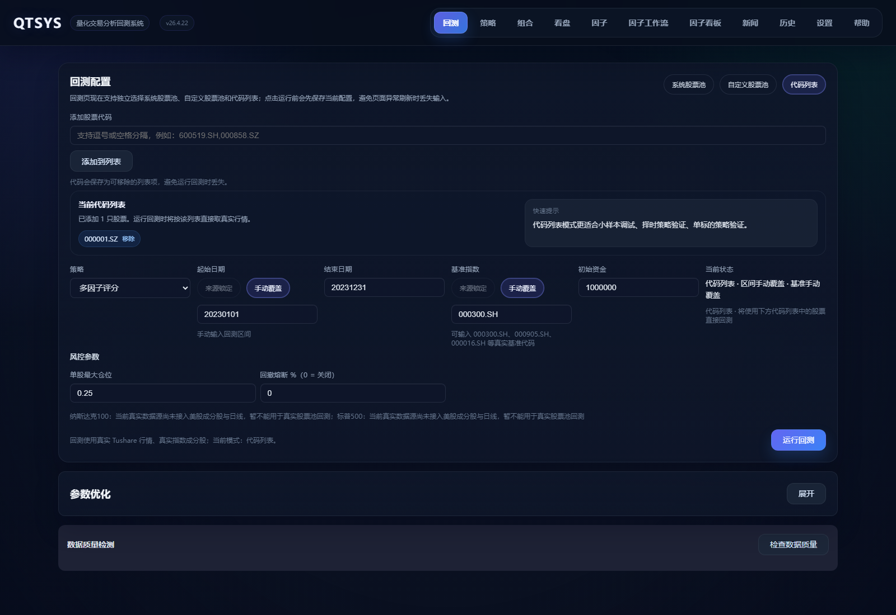

- 支持系统股票池、自定义股票池和代码列表三种回测模式
- 支持基准、日期区间、风控参数和资金参数配置
- 页面会尽量保留当前输入，避免回测前配置丢失

### 4. 回测历史与结果筛选

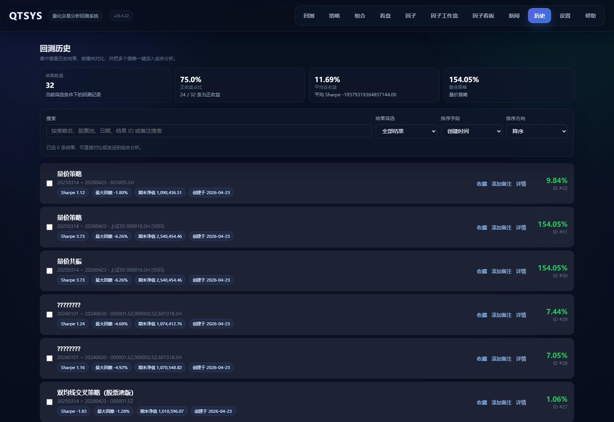

- 集中查看回测结果、收益表现和风险摘要
- 支持按策略名、日期、结果 ID、备注等条件筛选
- 可将多个结果送入组合分析继续比较

### 5. 组合分析

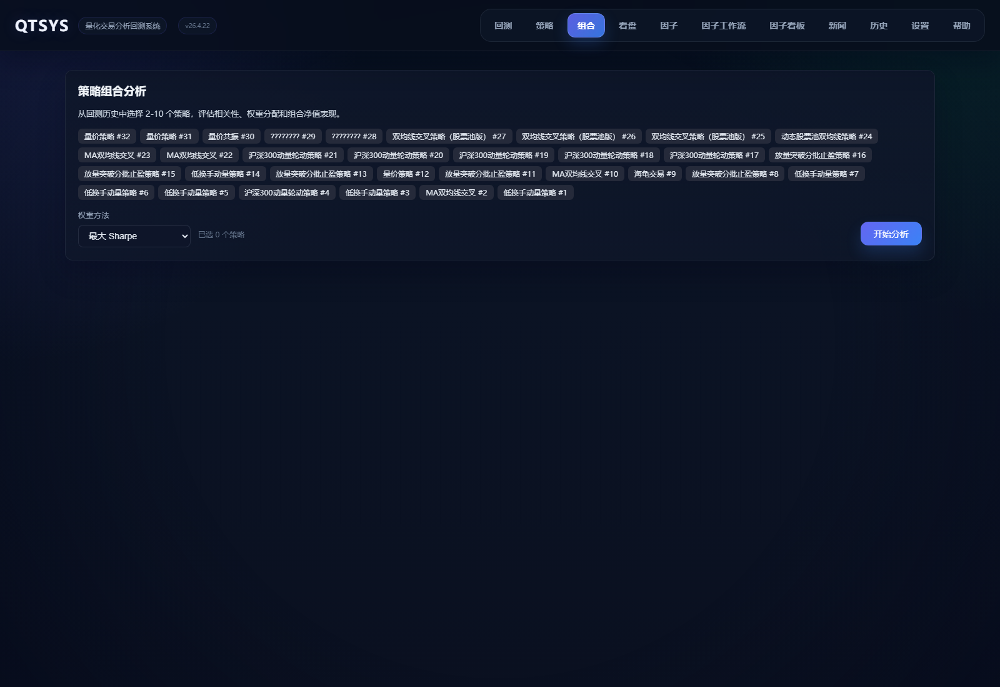

- 面向多策略结果做相关性、权重和组合收益分析
- 适合把策略筛选从“单策略最优”升级到“组合更稳健”

### 6. 因子研究

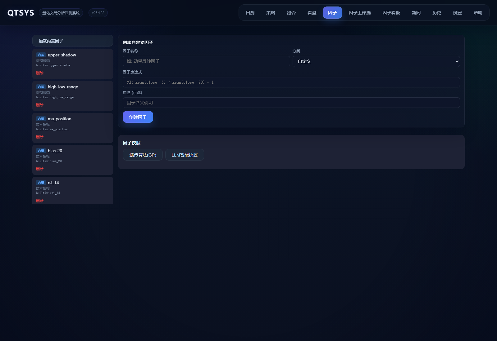

- 支持因子表达式研究、评价与结果可视化
- 可将研究结果一键发送到 AI 策略助手，生成因子驱动策略

### 7. 因子工作流

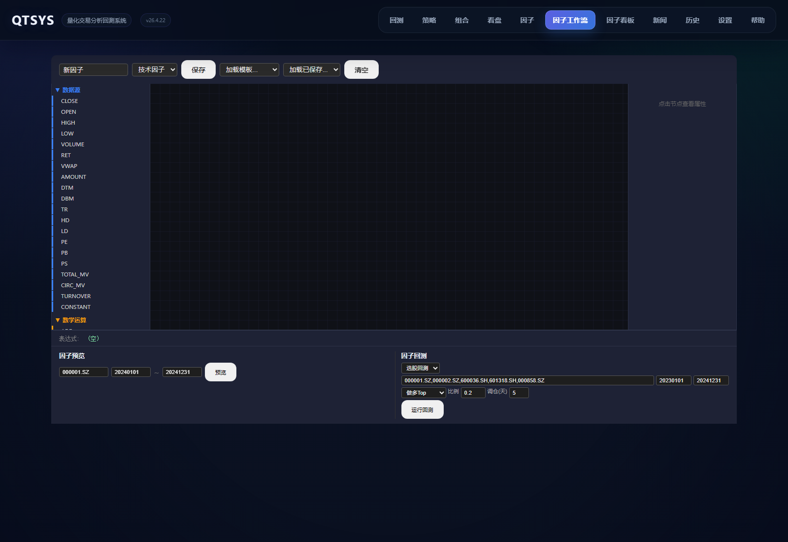

- 将因子筛选、评价、对比和策略生成串成统一流程
- 适合做多因子迭代研究和候选因子池管理

### 8. Alpha191 因子看板

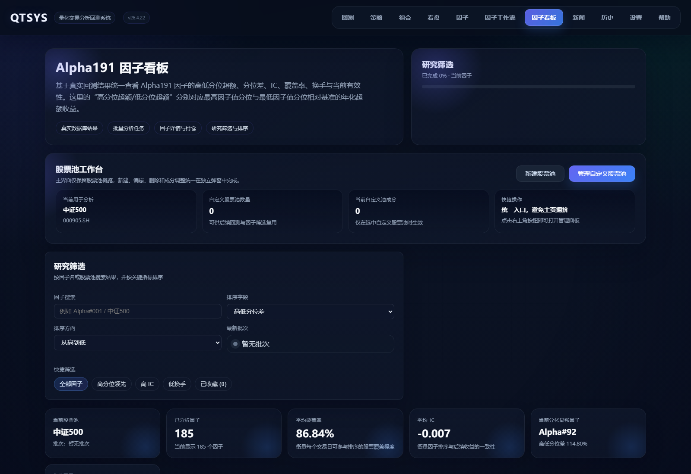

- 使用真实行情对 Alpha191 因子做批量分析
- 支持股票池管理、进度跟踪、失败因子重试和结果排序筛选
- 可查看因子详情、公式、解释、分位收益和策略生成入口

### 9. 市场看盘

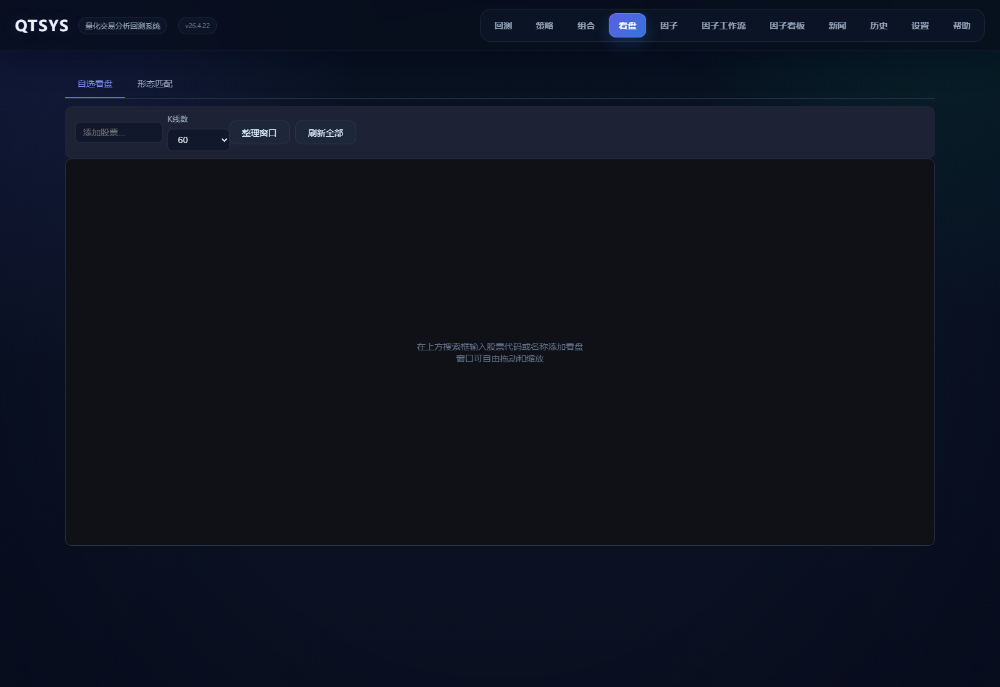

- 面向日常监控和盘中观察，辅助策略落地
- 适合结合策略、因子和新闻信息做人工复核

### 10. 新闻中心

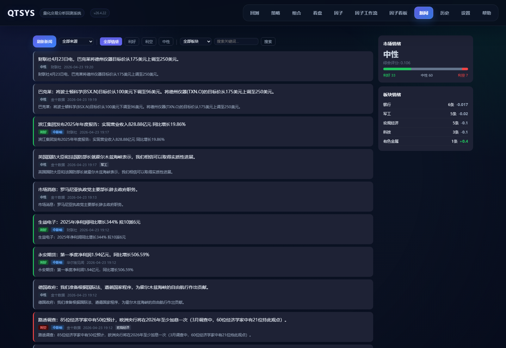

- 汇总新闻、情绪和主题信息
- 可作为 AI 生成策略时的市场环境输入

## 快速开始

### 1. 安装依赖

```bash
python -m venv .venv
.\.venv\Scripts\python.exe -m pip install -r requirements.txt
```

### 2. 启动系统

```bash
.\.venv\Scripts\python.exe main.py
```

启动后访问：

- `http://127.0.0.1:8000`

## 推荐使用顺序

### 第一步：完成基础配置

进入“设置”页，至少完成以下项目：

- `Tushare Token`
- 回测基础参数
- 如需使用 AI：配置 `API Key`、`接口地址`、`模型名称`
- 如需使用因子看板：配置 MySQL 连接

### 第二步：创建或生成策略

进入“策略”页后可选择：

- 手工新建策略
- 加载内置模板
- 使用 AI 生成策略草稿
- 从因子研究或因子看板结果一键生成策略

### 第三步：运行回测

进入“回测”页：

1. 选择策略
2. 选择股票池模式
3. 设置回测区间、基准和资金参数
4. 运行回测并查看收益、回撤和交易结果

### 第四步：查看历史与组合分析

回测完成后可进入“历史”页：

- 查看历史结果
- 添加备注
- 横向比较多个策略
- 将多个结果送入“组合分析”页做权重与组合优化

### 第五步：使用因子模块增强策略

可从两个入口使用因子能力：

- “因子”页：研究单因子并生成策略思路
- “因子看板”页：批量查看 Alpha191 因子的实时有效性

## 因子看板使用流程

1. 先在“设置”页保存 `Tushare Token`
2. 保存 MySQL 配置
3. 进入“因子看板”页，选择股票池与时间范围
4. 如有需要，先维护自定义股票池
5. 点击开始分析，系统会优先复用已有缓存并做增量更新
6. 在结果区查看：
   - 总收益与超额表现
   - IC / 覆盖率 / 换手等指标
   - 最强因子与分位表现
7. 点击具体因子可进入详情，查看：
   - 收益曲线
   - 多分位对比
   - 公式
   - 经济学含义解释
   - 策略生成入口

详细操作见 `docs/factor_board_guide.md`

## 策略与因子联动

系统支持在策略代码中直接调用因子：

- `context.get_factor('因子名', ts_code)`
- `context.get_factor_history('因子名', ts_code, count)`
- `context.list_factors(keyword='')`

示例：

```python
def initialize(context):
    context.target_pct = 0.2

def handle_data(context):
    for ts_code in context.universe:
        momentum = context.get_factor('momentum_20', ts_code)
        ma_hist = context.get_factor_history('ma_position', ts_code, 5)
        if len(ma_hist) < 3:
            continue
        pos = context.positions.get(ts_code)
        has_position = pos is not None and pos.amount > 0
        if momentum > 0.02 and ma_hist[-1] >= 0.5 and not has_position:
            context.order_target_percent(ts_code, context.target_pct)
        elif has_position and (momentum < -0.02 or ma_hist[-1] < 0.25):
            context.order(ts_code, -pos.amount)
```

这意味着你可以：

- 在策略代码中构建多因子策略
- 在 AI 提示词中直接要求“调用现有因子库”
- 从因子研究结果直接生成可回测策略

## 核心配置说明

| 配置项 | 用途 | 是否必需 |
| --- | --- | --- |
| `Tushare Token` | 获取真实行情、指数成分股和证券基础数据 | 是 |
| `LLM API Key / Base URL / Model` | AI 策略助手、因子挖掘、新闻分析 | 使用 AI 时必需 |
| SQLite | 保存系统设置、策略、回测结果和股票池 | 是 |
| MySQL | 因子看板行情缓存和批量分析结果存储 | 使用因子看板时建议启用 |

## 敏感信息安全

- `Tushare Token`、`LLM API Key`、`MySQL 密码` 会以加密形式保存到本地数据库
- 系统使用本地主密钥对敏感配置做透明加解密，主密钥默认保存在 `runtime/secrets/master.key`
- `runtime/` 目录已被 `.gitignore` 忽略，不会随 GitHub 一起提交
- 如需在新机器上继续使用原有密文配置，请同时迁移主密钥，或设置环境变量 `QTSYS_MASTER_KEY`
- 若主密钥丢失，已保存的密文配置将无法解密，需要重新在“设置”页填写
- 发布前可执行 `.\.venv\Scripts\python.exe scripts/security_check.py` 扫描当前工作区中的疑似明文密钥

## 目录结构

- `main.py`：FastAPI 入口
- `api/`：HTTP 路由层
- `services/`：业务编排层
- `engine/`：回测与组合分析引擎
- `factor/`：Alpha191、因子引擎和因子分析逻辑
- `data/`：Tushare 客户端、缓存与数据访问
- `database/`：数据库连接、模型与持久化
- `static/`：前端页面
- `pics/`：README 截图与架构图
- `docs/`：专项文档

更详细说明见 `docs/project_structure.md`

## 文档索引

- `docs/README.md`
- `docs/quick_start.md`
- `docs/project_structure.md`
- `docs/factor_board_guide.md`
- `docs/ai_strategy_assistant.md`
- `docs/delivery_summary.md`

## 常见问题

### 1. 因子看板无法启动

优先检查：

- `Tushare Token` 是否已保存
- MySQL 是否配置正确
- 股票池是否为空
- 当前是否已有分析任务在运行

### 2. 首次分析较慢

首次运行需要补齐历史行情缓存。后续同股票池和日期范围会优先复用缓存，仅做必要的增量更新。

### 3. AI 策略无法生成

优先检查：

- 设置页中的 `API Key`、`接口地址`、`模型名称` 是否已保存
- 接口是否兼容 OpenAI 风格 `chat/completions`
- 当前网络是否可访问所填模型服务

### 4. 页面能打开但结果为空

通常是以下原因之一：

- 数据源未配置
- 策略尚未保存
- 股票池为空
- 当前筛选条件过严
