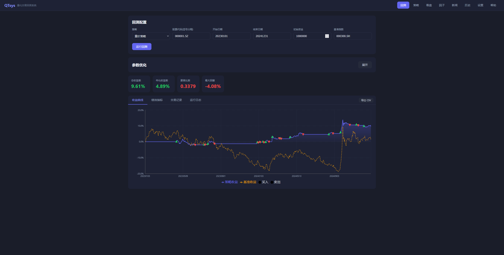

# QTsys - 量化金融分析系统

QTsys 是一个面向中国 A 股市场的全栈量化交易研究平台，集成了策略回测、因子研究、新闻舆情分析和 K 线形态匹配等功能。后端基于 Python/FastAPI，前端为 React 单页应用，开箱即用。

## 功能概览

- **策略回测** — 内置 9 种经典策略，支持在线编写自定义策略（策略编写的详细教程在帮助界面）
- **因子研究** — 14 个内置因子，支持自定义因子表达式、遗传规划(GP)因子挖掘、LLM 智能因子生成
- **新闻舆情** — 自动抓取四大财经网站新闻，关键词 + LLM 双重情感分析
- **K 线形态** — 基于滑动窗口相关性的历史形态匹配
- **真实模拟** — 佣金、印花税、滑点、涨跌停、T+1 交割、成交量限制
- **因子工作流** — 可视化节点编辑器，拖拽式构建因子表达式，实时编译与预览
- **策略组合** — 多策略相关性分析、最优权重配置（等权/反方差/最大夏普/风险平价）、组合回测
- **风险分析** — 回撤分解、VaR/CVaR、滚动波动率、月度收益热力图
- **归因分析** — 个股盈亏分解、行业归因（Brinson 模型）、月度超额收益
- **数据质量** — 回测前自动检测缺失数据、停牌、极端收益等异常

## 目录结构

```
QTsys/
├── main.py                 # 应用入口
├── config.py               # 全局配置
├── requirements.txt        # Python 依赖
├── api/                    # REST API 路由层
│   ├── routes_settings.py  # 系统设置
│   ├── routes_data.py      # 行情数据
│   ├── routes_strategy.py  # 策略管理
│   ├── routes_backtest.py  # 回测/风险/归因/组合
│   ├── routes_factor.py    # 因子研究与工作流
│   ├── routes_factor_backtest.py  # 因子回测
│   ├── routes_news.py      # 新闻舆情
│   ├── routes_market.py    # K线与形态匹配
│   └── routes_quality.py   # 数据质量检测
├── engine/                 # 回测引擎核心
│   ├── backtest_engine.py  # 回测主循环
│   ├── broker.py           # 模拟券商（佣金/滑点/涨跌停）
│   ├── context.py          # 订单/持仓数据结构
│   ├── metrics.py          # 绩效指标计算
│   ├── risk.py             # 风险分析（回撤/VaR/滚动波动率）
│   ├── attribution.py      # 归因分析（个股/行业/月度）
│   ├── portfolio.py        # 组合分析（相关性/最优权重）
│   └── optimizer.py        # 参数优化与Walk-Forward验证
├── data/                   # 行情数据层
│   ├── tushare_client.py   # Tushare API 封装
│   ├── data_cache.py       # 本地 pickle 缓存
│   ├── quality.py          # 数据质量检测
│   └── cache/              # 缓存文件目录
├── database/               # 数据库层
│   ├── connection.py       # SQLAlchemy 异步引擎
│   └── models.py           # ORM 模型定义
├── strategy/               # 策略框架
│   ├── base_strategy.py    # 策略 API 说明
│   ├── strategy_loader.py  # 动态代码加载（沙箱执行）
│   └── builtin/            # 9 个内置策略
├── factor/                 # 因子研究模块
│   ├── builtin_factors.py  # 14 个内置因子
│   ├── factor_engine.py    # 因子评估引擎
│   ├── factor_backtest.py  # 因子回测引擎
│   ├── graph_compiler.py   # 工作流图编译器
│   ├── genetic.py          # 遗传规划因子挖掘
│   └── llm_miner.py        # LLM 因子生成
├── news/                   # 新闻模块
│   ├── scraper.py          # 异步新闻爬虫
│   └── analyzer.py         # 情感分析
└── static/                 # 前端文件
    ├── index.html           # React SPA 主页面
    └── lib/                 # 前端依赖库
```

## 快速开始

### 环境要求

- Python 3.10+
- [Tushare](https://tushare.pro/) 账号及 API Token（用于获取 A 股行情数据）

### 安装

```bash
# 克隆项目
git clone https://github.com/your-username/QTsys.git
cd QTsys

# 安装依赖
pip install -r requirements.txt
```

### 启动

```bash
python main.py
```

服务启动后访问 `http://localhost:8000` 即可打开 Web 界面。

### 首次配置

1. 进入页面后，点击「系统设置」
2. 填入你的 Tushare API Token（必填，否则无法获取行情数据）
3. 如需使用 LLM 因子挖掘或新闻深度分析功能，填入 OpenAI 兼容 API 的地址和 Key
4. 交易成本参数（佣金、印花税、滑点等）可按需调整，已有合理默认值

## 使用指南

### 一、策略回测

这是系统的核心功能，完整流程如下：

#### 1. 选择或编写策略



系统内置 9 种经典量化策略，可直接使用：

| 策略 | 说明 |
|------|------|
| 双均线交叉 | MA5/MA20 金叉买入、死叉卖出 |
| RSI 反转 | RSI 超卖买入、超买卖出 |
| MACD 信号 | MACD 金叉/死叉交易 |
| 布林带突破 | 价格突破布林带上下轨 |
| 动量策略 | N 日动量排名选股 |
| 海龟交易 | Donchian 通道 + ATR 仓位管理 |
| 量价突破 | 放量突破前高买入 |
| 多因子选股 | 多因子综合打分选股 |
| 均值回归 | Z-score 偏离度回归交易 |

也可以在页面内置的代码编辑器中编写自定义策略。策略的实现需实现两个函数：

```python
def initialize(context):
    """策略初始化，设置参数"""
    context.short_period = 5
    context.long_period = 20

def handle_data(context):
    """每个交易日调用一次"""
    for ts_code in context.universe:
        closes = context.get_history(ts_code, 20, "close")
        price = context.get_price(ts_code)
        # 你的交易逻辑...
        context.order(ts_code, 100)       # 买入100股
        context.order(ts_code, -100)      # 卖出100股
```

#### 2. 策略 API 参考

在 `initialize` 和 `handle_data` 中，通过 `context` 对象访问以下接口：

| API | 说明 |
|-----|------|
| `context.order(ts_code, amount)` | 按股数下单，正数买入，负数卖出 |
| `context.order_target_percent(ts_code, pct)` | 调仓至目标仓位百分比 |
| `context.order_value(ts_code, value)` | 按金额下单 |
| `context.get_price(ts_code)` | 获取当前收盘价 |
| `context.get_history(ts_code, count, field)` | 获取最近 N 日历史数据 |
| `context.positions` | 当前持仓字典 `{ts_code: Position}` |
| `context.cash` | 可用资金 |
| `context.portfolio_value` | 账户总资产（现金 + 持仓市值） |
| `context.universe` | 当前股票池列表 |
| `context.log(msg)` | 输出日志信息 |

#### 3. 配置回测参数

在回测页面设置以下参数：

- **股票池** — 输入股票代码（Tushare 格式，如 `000001.SZ`、`600519.SH`），支持多只股票
- **回测区间** — 起止日期（如 `20200101` ~ `20231231`）
- **初始资金** — 默认 100 万元
- **基准指数** — 默认沪深300（`000300.SH`），用于计算 Alpha、Beta 等相对指标

#### 4. 运行回测与查看结果

点击「运行回测」后，系统将逐日模拟交易，完成后展示：

- **净值曲线** — 策略净值 vs 基准净值对比图
- **绩效指标** — 总收益率、年化收益率、夏普比率、索提诺比率、卡玛比率、最大回撤、Alpha、Beta、信息比率、胜率、盈亏比等
- **交易记录** — 每笔成交的时间、股票、方向、数量、价格、佣金、印花税
- **运行日志** — 策略 `context.log()` 输出的调试信息

#### 5. 回测引擎机制

回测引擎严格模拟 A 股真实交易环境：

| 机制 | 说明 |
|------|------|
| 佣金 | 万三（0.03%），最低 5 元 |
| 印花税 | 千一（0.1%），仅卖出时收取 |
| 滑点 | 0.2%，基于开盘价模拟 |
| 涨跌停 | ±10%，涨停无法买入，跌停无法卖出 |
| T+1 交割 | 当日买入的股票次日才可卖出 |
| 成交量限制 | 单笔委托不超过当日成交量的 25% |
| 买入单位 | 最小 100 股（1 手），自动取整 |

### 二、因子研究

因子研究模块用于发现和验证选股因子的有效性。

#### 1. 内置因子

系统提供 14 个覆盖 5 大类别的内置因子：

| 类别 | 因子 |
|------|------|
| 动量 | 5日动量、20日动量、60日动量 |
| 反转 | 5日反转、20日反转 |
| 波动率 | 20日波动率 |
| 成交量 | 成交量比率、量价相关性 |
| 技术指标 | RSI、MACD、布林带宽度、换手率、价格偏离度等 |

#### 2. 自定义因子

在因子页面输入因子表达式，支持的变量和函数：

- 变量：`close`（收盘价）、`high`（最高价）、`low`（最低价）、`vol`（成交量）、`returns`（日收益率）
- 滚动函数：`mean(x, n)`、`std(x, n)`、`ts_max(x, n)`、`ts_min(x, n)`、`delta(x, n)`、`delay(x, n)`
- 运算：`rank`、`abs`、`log`、四则运算

示例：`mean(close, 5) / mean(close, 20) - 1`（5日/20日均线偏离度）

#### 3. 因子评估

选择因子后点击「评估」，系统将计算以下指标：

- **Rank IC** — 因子值与下期收益的秩相关系数，衡量因子预测能力
- **ICIR** — IC 均值 / IC 标准差，衡量因子稳定性（ICIR > 0.5 通常认为有效）
- **分组收益** — 按因子值五等分，观察各组收益是否单调递增/递减
- **多空收益曲线** — 做多因子值最高组、做空最低组的累计收益
- **换手率** — 因子排名的变化频率，影响实际交易成本

#### 4. GP 遗传规划因子挖掘

系统内置基于表达式树的遗传规划算法，可自动搜索有效因子：

1. 在因子页面选择「GP 因子挖掘」
2. 设置参数：种群大小、迭代代数、最大表达式深度等
3. 点击运行，算法将通过交叉、变异、选择等操作自动进化因子表达式
4. 适应度函数 = IC + ICIR，优先选出预测力强且稳定的因子
5. 挖掘完成后可直接保存有效因子到因子库

#### 5. LLM 智能因子生成

需在系统设置中配置 OpenAI 兼容 API（地址 + Key）：

1. 在因子页面选择「LLM 因子挖掘」
2. 系统向 LLM 发送提示词，请求生成因子表达式
3. 自动解析返回结果并进行因子评估
4. 有效因子可一键保存

### 三、新闻舆情分析

#### 1. 新闻抓取

系统支持从以下四大财经网站异步抓取新闻：

| 来源 | 说明 |
|------|------|
| 新浪财经 | 综合财经新闻 |
| 东方财富 | 股票资讯与公告 |
| 财联社 | 快讯与深度报道 |
| 同花顺 | 行情相关资讯 |

在新闻页面点击「抓取新闻」即可获取最新资讯。

#### 2. 情感分析

系统提供两种情感分析方式：

- **关键词分析**（默认） — 内置 70+ 金融正负面词汇，自动识别情感倾向、涉及板块（银行、地产、科技、新能源等 13 个板块）和影响等级（高/中/低）
- **LLM 深度分析**（可选） — 调用 OpenAI 兼容 API 进行更精准的语义理解和情感判断

#### 3. 市场情绪聚合

系统自动汇总多篇新闻的情感得分，生成整体市场情绪指标，辅助判断市场氛围。

### 四、K 线形态匹配

1. 在 K 线页面输入股票代码，加载历史 K 线图
2. 在图表上绘制你认为的走势形态（一段曲线）
3. 系统使用滑动窗口 + 皮尔逊相关系数在全市场历史数据中搜索相似形态
4. 返回匹配度最高的历史片段，帮助判断后续走势可能性

该功能使用线程池并行计算，支持跨股票搜索。

### 五、因子工作流

因子工作流是一个可视化的节点编辑器，通过拖拽连线的方式构建因子表达式，无需手写代码。

#### 1. 界面布局

- **左侧面板** — 节点面板，按类别折叠展示所有可用节点，拖拽到画布即可添加
- **中央画布** — 节点编辑区域，支持缩放（滚轮）、平移（右键拖拽）、连线（从输出端口拖到输入端口）
- **右侧面板** — 属性检查器，选中节点后可编辑其参数（如窗口期、常数值等）
- **底部区域** — 因子预览（单股票因子值曲线）和因子回测

#### 2. 节点类型

系统提供 6 大类共 40+ 个节点：

| 类别 | 节点示例 | 说明 |
|------|---------|------|
| 数据源 | close、open、high、low、volume、returns、pe、pb、turnover、constant | 原始行情和基本面数据 |
| 数学运算 | add、sub、mul、div、abs、log、sqrt、power、clip | 四则运算和数学函数 |
| 时序运算 | mean、std、sum、delay、delta、pctchange、corr、cov、ewm、decay | 滚动窗口时序计算 |
| 截面运算 | cs_rank、cs_zscore、cs_percentile、cs_demean | 截面标准化 |
| 条件逻辑 | gt、lt、and、or、ternary | 布尔判断和条件选择 |
| 输出 | output | 标记最终因子值（每个图必须有且仅有一个） |

#### 3. 操作方式

1. 从左侧面板拖拽节点到画布
2. 从节点的输出端口（右侧圆点）拖拽连线到另一个节点的输入端口（左侧圆点）
3. 选中节点后在右侧面板调整参数（如滚动窗口天数）
4. 最终将计算结果连接到 output 节点
5. 系统实时编译并在表达式栏显示结果（绿色=成功，红色=有错误）

快捷键：`Delete` 删除选中节点/连线，`Ctrl+Z` 撤销，`Ctrl+Y` 重做。

#### 4. 内置模板

系统提供 5 个常用因子模板，可一键加载到画布：

| 模板 | 表达式 |
|------|--------|
| 动量因子 | `close / delay(close, 20) - 1` |
| 波动率因子 | `std(returns, 20)` |
| 价值因子 | `1 / pe` |
| 反转因子 | `-pctchange(close, 5)` |
| 量价背离 | `corr(close, volume, 10)` |

#### 5. 因子预览与回测

构建完因子后，可以在底部面板进行：

- **因子预览** — 输入单只股票代码和日期范围，查看因子值的时序曲线，快速验证因子逻辑是否合理
- **选股回测** — 在股票池中按因子值排名选股（选最高/最低 N%），定期调仓，查看策略净值和绩效指标
- **技术信号回测** — 设置因子值的开仓/平仓阈值，当因子值突破阈值时触发交易信号

#### 6. 保存与管理

- 点击「保存」将因子（含完整图结构）存入数据库，可随时重新加载编辑
- 保存时需选择因子类型（技术因子/选股因子），影响后续回测方式
- 已保存的因子可在因子研究页面中与其他因子一起评估和对比

### 六、策略组合分析

当你有多个回测结果后，可以通过组合分析功能研究策略之间的关系并构建最优组合。

#### 1. 进入组合页面

在顶部导航栏点击「组合」进入组合分析页面。

#### 2. 选择策略

从历史回测记录中勾选 2-10 个回测结果。建议选择不同类型的策略（如动量 + 反转 + 均值回归），以获得更好的分散化效果。

#### 3. 相关性分析

系统自动计算所选策略之间的日收益率相关性矩阵，以热力图形式展示：

- 蓝色 → 负相关（策略互补，分散化效果好）
- 白色 → 无相关
- 红色 → 正相关（策略同质化，分散化效果差）

同时提供 60 日滚动相关性曲线，观察策略关系是否随时间变化。

#### 4. 最优权重配置

系统支持 4 种权重分配方法：

| 方法 | 说明 |
|------|------|
| 等权 (1/N) | 每个策略分配相同权重，最简单 |
| 反方差 | 波动率低的策略分配更多权重 |
| 最大夏普 | 均值-方差优化，追求最高风险调整收益 |
| 风险平价 | 每个策略对组合风险的贡献相等 |

#### 5. 组合回测

按计算出的权重合成组合日收益率，生成组合净值曲线和绩效指标（年化收益、夏普比率、最大回撤等），与各单策略对比展示。

### 七、风险分析与归因

在回测结果详情页中，新增了「风险分析」和「归因分析」两个标签页。

#### 风险分析

- **回撤分解** — 识别所有显著回撤事件（默认阈值 ≥2%），展示水下曲线（underwater curve）
- **风险度量** — VaR(95%)、CVaR(95%)、偏度、峰度、Jarque-Bera 正态性检验
- **滚动指标** — 20日/60日滚动波动率、60日滚动夏普比率
- **收益分布** — 日收益直方图 + VaR/CVaR 标线
- **月度热力图** — 按年-月展示月度收益率，绿色盈利、红色亏损

#### 归因分析

- **个股盈亏** — 按股票分解已实现盈亏，展示 Top 盈利和 Top 亏损股票
- **行业归因** — 基于 Brinson 模型分解配置效应、选择效应和交互效应
- **月度归因** — 按月对比策略收益与基准收益，计算每月超额收益

### 八、数据质量检测

在回测页面的配置区域，点击「检查数据质量」按钮，可在回测前检测股票池数据的健康状况。

检测项目包括：

| 检测项 | 说明 |
|--------|------|
| 缺失日期 | 对比交易日历，计算数据缺失率 |
| 停牌检测 | OHLC 全相等的交易日 |
| 零成交量 | 价格变动但成交量为零 |
| 极端收益 | 日收益率超过 ±11%（超涨跌停限制） |
| 价格粘滞 | 连续多日收盘价完全相同 |
| 数据新鲜度 | 最后可用日期是否覆盖回测区间 |
| 退市检测 | 标记回测期间已退市的股票 |

检测结果按严重程度分为「正常」「警告」「异常」三级，并给出处理建议。可一键移除问题股票后再运行回测。

## 系统配置

### 默认交易参数

| 参数 | 默认值 | 说明 |
|------|--------|------|
| 初始资金 | 1,000,000 元 | 回测起始资金 |
| 佣金费率 | 0.03%（万三） | 买卖双向收取，最低 5 元 |
| 印花税 | 0.1%（千一） | 仅卖出时收取 |
| 滑点 | 0.2% | 模拟实际成交偏差 |
| 成交量限制 | 25% | 单笔不超过当日成交量的 25% |

以上参数均可在 Web 界面的「系统设置」页面中修改，修改后保存至数据库。

### LLM 配置（可选）

如需使用 LLM 因子挖掘和新闻深度分析功能，需在系统设置中配置：

- **API 地址** — OpenAI 兼容接口的 Base URL
- **API Key** — 对应的认证密钥
- **模型名称** — 使用的模型 ID

支持任何兼容 OpenAI Chat Completions API 的服务。

## 技术架构

```
浏览器 (React SPA)
    │
    ▼
FastAPI REST API (10 个路由模块)
    │
    ├── 系统设置 ──→ SQLite (settings 表)
    ├── 行情数据 ──→ 本地缓存 ──→ Tushare API
    ├── 策略管理 ──→ SQLite (strategies 表) + 沙箱代码加载
    ├── 策略回测 ──→ 回测引擎 (逐日事件驱动)
    ├── 风险/归因/组合 ──→ 专业分析引擎
    ├── 因子研究 ──→ 因子引擎 + GP挖掘 + LLM生成
    ├── 因子工作流 ──→ 图编译器 + 因子回测引擎
    ├── 新闻舆情 ──→ 异步爬虫 + 情感分析
    ├── K线形态 ──→ 滑动窗口相关性匹配
    └── 数据质量 ──→ 质量检测引擎
    │
    ▼
SQLite (qtsys.db) + Pickle 缓存 (data/cache/)
```

### 技术栈

| 层级 | 技术 |
|------|------|
| 后端框架 | FastAPI + Uvicorn (异步) |
| 数据库 | SQLite + SQLAlchemy 2.0 (异步 ORM) |
| 数据源 | Tushare Pro API |
| 数值计算 | Pandas + NumPy |
| 新闻爬虫 | httpx + BeautifulSoup4 (异步) |
| 前端 | React + Recharts + CodeMirror |
| 前端构建 | 无需构建，Babel 浏览器端转译 JSX |

### 数据库表结构

| 表名 | 用途 |
|------|------|
| `settings` | 系统配置（Tushare Token、交易成本、LLM API 等） |
| `strategies` | 策略代码存储（名称、描述、Python 源码） |
| `backtest_results` | 回测结果（绩效指标、净值曲线、交易记录） |
| `factors` | 因子定义（名称、表达式、类别、来源） |
| `factor_results` | 因子评估结果（IC 序列、分组收益、多空曲线） |
| `news_articles` | 新闻存储（标题、内容、情感得分、板块标签） |

## API 接口

系统提供以下 REST API，前端通过这些接口与后端交互，也可用于二次开发：

| 路径前缀 | 功能 |
|----------|------|
| `GET /` | 访问 Web 界面 |
| `/api/settings` | 系统设置的读取与保存 |
| `/api/data` | 行情数据查询（日线、指数、交易日历） |
| `/api/strategies` | 策略的增删改查、内置策略初始化 |
| `/api/backtest` | 执行回测、历史记录、风险分析、归因分析、组合分析 |
| `/api/factors` | 因子管理、评估、GP 挖掘、LLM 生成、工作流编译/预览/保存 |
| `/api/factor_backtest` | 因子选股回测、技术信号回测 |
| `/api/news` | 新闻抓取、情感分析、市场情绪聚合 |
| `/api/market` | K 线数据、形态匹配 |
| `/api/quality` | 数据质量检测、退市检测 |

## 常见问题

**Q: 启动后页面空白或报错？**
A: 确认已安装所有依赖 (`pip install -r requirements.txt`)，并检查终端是否有报错信息。

**Q: 无法获取行情数据？**
A: 请在「系统设置」中填入有效的 Tushare API Token。免费 Token 有每日调用次数限制，如需大量数据建议升级 Tushare 积分。

**Q: 回测速度慢？**
A: 首次回测需从 Tushare 下载数据，后续会使用本地缓存加速。股票池越大、回测区间越长，耗时越多。

**Q: LLM 功能不可用？**
A: LLM 因子挖掘和新闻深度分析为可选功能，需在系统设置中配置 OpenAI 兼容 API 的地址和 Key。

**Q: 策略代码报错？**
A: 策略在沙箱中执行，禁止导入 `os`、`sys`、`subprocess` 等系统模块。请确保策略仅使用 `context` API 和 `numpy`、`pandas` 等数据处理库。

## Alpha191 因子系统

### 完整的191个因子库

系统已集成所有191个Alpha191短周期价量因子，支持：

- ✅ **自动工作流生成**：输入1-191自动生成可视化节点图
- ✅ **横向树状布局**：清晰展示因子计算逻辑
- ✅ **一键回测**：直接预览和回测任意因子
- ✅ **批量测试**：快速筛选高IC_IR因子

### 使用方法

1. 进入"因子工作流"页面
2. 点击"加载模板" → "Alpha191因子"
3. 输入因子编号（1-191）
4. 查看自动生成的工作流图
5. 点击"预览"或"运行回测"

### 高级分析API

```python
# 批量测试
POST /api/alpha191/batch_test

# 因子相关性分析
POST /api/advanced_analysis/correlation

# 因子组合优化
POST /api/advanced_analysis/combine

# 因子衰减分析
POST /api/advanced_analysis/decay

# 行业中性化
POST /api/advanced_analysis/neutralize

# 因子归因分析
POST /api/advanced_analysis/attribution
```

详细文档：
- [快速使用指南](QUICK_START.md)
- [高级分析指南](ADVANCED_ANALYSIS_GUIDE.md)
- [完整报告](ALPHA191_COMPLETE_REPORT.md)

## 免责声明

本系统仅供学习和研究使用，不构成任何投资建议。量化策略的历史回测表现不代表未来收益，投资有风险，入市需谨慎。

## License

MIT
